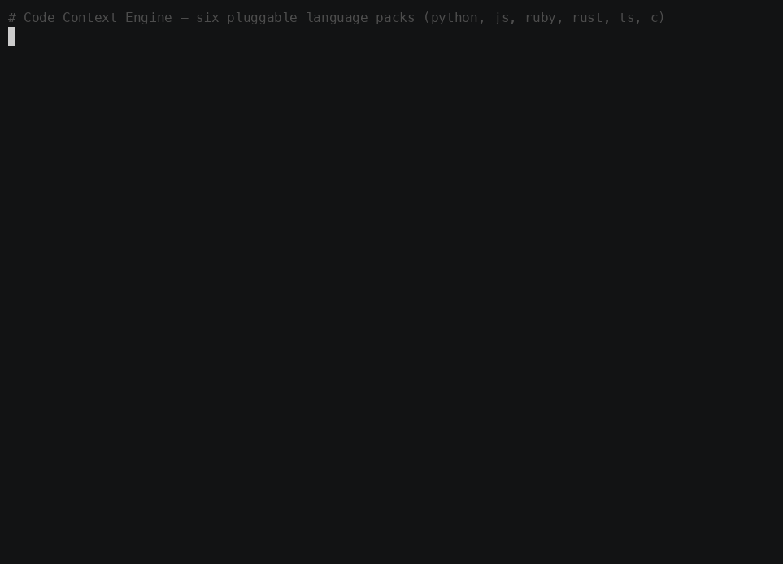
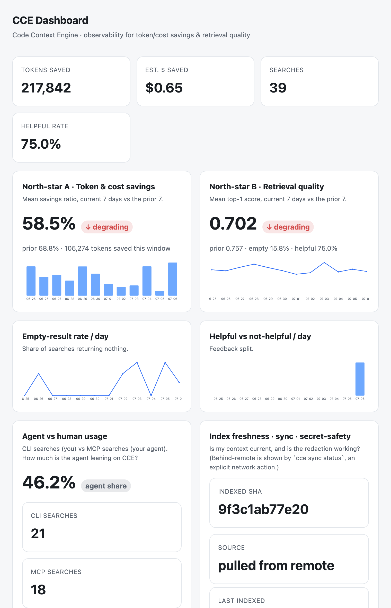

# Code Context Engine (CCE) — Ruby implementation

A local command-line tool that indexes a source-code repository so a program (or
an AI agent) can **search** for the most relevant code snippets instead of
reading whole files. It AST-chunks files with tree-sitter, embeds each chunk,
stores a vector + keyword index on disk, and answers queries with hybrid vector
+ BM25 retrieval — entirely on your machine, with no network calls by default.

> **Provenance.** This is a **clean-room reimplementation, built test-first
> from the specification in [`SPEC.md`](SPEC.md)** as an experiment. A sibling
> implementation in Rust — built from the *identical* spec — lives at
> [davidslv/cce-rust](https://github.com/davidslv/cce-rust). Both are **SPEC
> v1.0** at the core, extended cumulatively by the **v1.1 dashboard/observability
> addendum** ([`DASHBOARD-SPEC.md`](DASHBOARD-SPEC.md)), the **v2.0 pluggable
> language packs** ([`SPEC-V2.md`](SPEC-V2.md)), **v2.1 secret-scrubbing**
> ([`SPEC-V2.1.md`](SPEC-V2.1.md)), **v2.2 workspaces**
> ([`SPEC-V2.2.md`](SPEC-V2.2.md)), **v2.3 CCE Sync**
> ([`SPEC-SYNC.md`](SPEC-SYNC.md)), and **v2.4 CCE MCP**
> ([`SPEC-MCP.md`](SPEC-MCP.md)). The current release, **v2.4.1**, is a dashboard
> refresh + verified, offline-first documentation sweep. The experiment (and what
> it says about specs as programs) is written up here:
> [The spec was the program](https://davidslv.uk/2026/07/05/the-spec-was-the-program.html).

> **v2.0 (breaking).** Language support is now a **pluggable pack architecture**:
> the core engine holds zero language-specific knowledge and resolves each file to
> a `LanguagePack` through a registry. Six languages ship — **Ruby, Rust,
> TypeScript, C, Python, JavaScript** — each a self-contained pack validated by a
> three-layer safety rail (`cce packs --validate`). Every chunk now carries a
> `kind` (its exact tree-sitter node type), and the `conformance.json` chunk shape
> gained that field. See [`docs/adding-a-language.md`](docs/adding-a-language.md).

## Walkthrough



▶ **Interactive version:** open [`docs/presentation/index.html`](docs/presentation/index.html)
in a browser — a self-contained, autoplaying terminal cast (no dependencies, no network).

## Pipeline

```
index a directory
  → walk files → AST-chunk each file into functions/classes (tree-sitter)
  → embed each chunk into a 256-dim vector (deterministic hashing embedder)
  → store vectors + a BM25 keyword index + a small import graph on disk (SQLite)
search a query
  → hybrid retrieve: cosine vector similarity + BM25 + Reciprocal Rank Fusion
  → confidence-score, penalize test/doc paths, enforce per-file diversity
  → optionally expand via the import graph
  → return the top-K ranked chunks
```

## Requirements

- **Ruby 3.2+** (developed on 3.4.7).
- A C toolchain is **not** required at runtime: the tree-sitter grammars for all
  six supported languages (Ruby, Rust, TypeScript, C, Python, JavaScript) are
  provided as prebuilt dylibs by the `tree_sitter_language_pack` gem and loaded
  through the `ruby_tree_sitter` bindings.
- **CCE Sync only** (optional, see the *CCE Sync* section below): `git`, and
  `git-lfs` if you keep the LFS default on. Everything else works with no network
  and no extra tools.

### Install

#### macOS

```bash
brew install ruby git git-lfs   # Ruby 3.2+; git & git-lfs are only needed for CCE Sync
git lfs install                 # one-time, per user (CCE Sync with LFS)
git clone https://github.com/davidslv/cce-ruby && cd cce-ruby
bundle install
bundle exec rake test           # deterministic, hermetic, no network
```

#### Ubuntu

```bash
sudo apt-get update
sudo apt-get install -y ruby-full git git-lfs   # Ruby 3.2+
git lfs install                                 # one-time, per user (CCE Sync with LFS)
git clone https://github.com/davidslv/cce-ruby && cd cce-ruby
bundle install
bundle exec rake test
```

Verify the binary: `bundle exec bin/cce help`.

## Supported languages

Each language is one **pack** (`lib/cce/packs/<name>.rb`): a small, self-contained
unit that declares its extensions, its function/class node types, its import rule,
and a self-test sample. Adding a language is *add one pack file + register it + it
passes `cce packs --validate`* — no core edits.

| Pack | Extensions | Chunks (function / class) | Imports from |
|---|---|---|---|
| `ruby` | `.rb` | methods, singleton methods / classes, modules | `require`, `require_relative` |
| `rust` | `.rs` | `fn` items / struct·enum·trait·impl·union items | `use` (first path segment) |
| `typescript` | `.ts`, `.tsx` | functions, methods, arrow/function exprs / class·interface·enum decls | `import … from "x"` |
| `c` | `.c`, `.h` | function definitions / struct·union·enum specifiers | `#include <…>` / `"…"` |
| `python` | `.py` | function defs / class defs | `import`, `from … import` |
| `javascript` | `.js`, `.jsx`, `.mjs`, `.cjs` | functions, methods, arrow/function exprs / class decls | `import … from "x"` |

Files with no matching pack fall back to a single whole-file `module` chunk.
Run `cce packs` to list what is registered, or `cce packs --validate` to run the
structural, grammar-binding, and behavioural validators over every pack.

## Quickstart

```sh
# 1. Install dependencies (Ruby >= 3.2 required)
bundle install

# 2. Run the test suite (deterministic, hermetic, no network)
bundle exec rake test

# 3. Index a directory (writes a store under <dir>/.cce/index.db by default)
bundle exec bin/cce index path/to/repo

# 4. Search it (loads the store from a fresh process)
bundle exec bin/cce search "hash the password" --dir path/to/repo --top-k 10
```

> The first `index`/`search`/`conformance` run downloads the six grammar
> libraries into a local cache (one-time, requires network). The default test
> suite assumes that cache is already warm and performs no network I/O.

## Usage

```sh
# Index a directory (writes a store under <dir>/.cce/index.db by default).
# Secret protection is ON by default: sensitive files are skipped and inline
# secrets are redacted before anything is stored (see "Secret protection" below).
bundle exec bin/cce index path/to/repo

# Opt out of secret protection for a single run (not recommended)
bundle exec bin/cce index path/to/repo --allow-secrets

# Search (loads the store from a fresh process)
bundle exec bin/cce search "hash the password" --dir path/to/repo --top-k 10
bundle exec bin/cce search "process payment" --dir path/to/repo --json --no-graph

# Corpus statistics
bundle exec bin/cce stats --dir path/to/repo

# Benchmark against a pinned repo, writing docs/BENCHMARKS.md
bundle exec bin/cce bench path/to/sinatra

# List / validate the language packs
bundle exec bin/cce packs
bundle exec bin/cce packs --validate

# Cross-implementation conformance output (over the seven sample fixtures)
bundle exec bin/cce conformance test/fixture/samples -o conformance.json
```

### Commands

| Command | Purpose |
|---|---|
| `index <dir> [--store PATH] [--embedder hash\|ollama] [--allow-secrets]` | Walk, chunk, embed, persist. Secret-safe by default; `--allow-secrets` opts out. |
| `search <query> [--dir DIR \| --store PATH] [--top-k N] [--no-graph] [--json]` | Load store, run retrieval. |
| `stats [--dir DIR \| --store PATH]` | Chunk/file counts, per-language and per-`kind` breakdown, avg tokens, store size. |
| `bench <repo-dir> [--lang ruby\|rust\|typescript\|c] [--queries FILE] [--store PATH]` | Run the benchmark, write `docs/BENCHMARKS.md`. |
| `packs [--validate]` | List registered language packs, or run the three-layer validators over every pack. |
| `conformance <fixture-dir> [-o FILE]` | Emit the deterministic `conformance.json` (chunks include `kind`). |
| `feedback <query-id> --helpful\|--not-helpful [--note "…"] [--dir DIR \| --store PATH]` | Rate a past search result (v1.1). |
| `dashboard [--dir DIR \| --store PATH] [--port N] [--no-open]` | Serve the read-only, loopback-only metrics dashboard (v1.1). |
| `workspace init [<dir>] [--force]` | Detect members → write `.cce/workspace.yml` (v2.2). |
| `workspace list [<dir>]` | Print members + cross-member edges (v2.2). |
| `index --workspace [<dir>]` | Index each member into its own store + build the graph (v2.2). |
| `search <query> --workspace [<dir>] [--package a,b] […]` | Federated search over the members' union (v2.2). |
| `stats --workspace [<dir>]` | Per-member metrics + totals + edges (v2.2). |
| `dashboard --workspace [<dir>]` | Federated roll-up dashboard with a per-package breakdown (v2.2). |
| `init [<dir>] [--agent claude] [--remote <sync-url>] [--force]` | Ensure an index + wire the editor's MCP config (v2.4). |
| `mcp [--dir DIR \| --store PATH] [--workspace]` | Serve the read-only MCP server over stdio (JSON-RPC 2.0) (v2.4). |

## Use it with Claude Code (MCP)

CCE ships an **MCP server** so an agent (Claude Code, Cursor, …) calls CCE as a
**native tool it auto-invokes** — you stop hoping it shells out to `cce search`.
This closes the one gap between clean-room CCE and the original: agent
integration. Full guide: [`docs/mcp.md`](docs/mcp.md).

```sh
# 1. In your project root, wire everything up (idempotent):
bundle exec bin/cce init .
#   → ensures an index, writes .mcp.json + a CLAUDE.md block, prints next steps

# 2. Restart Claude Code so it loads the `cce` MCP server (per .mcp.json).

# 3. Ask a question about the codebase — e.g. "where is password hashing?".
#    The agent calls the context_search tool instead of grepping.

# 4. Confirm it was used:
bundle exec bin/cce dashboard --dir .
#   → the dashboard shows the agent's queries + token savings
```

`cce init` writes this `.mcp.json` (a workspace gets `["mcp", "--workspace"]`):

```json
{ "mcpServers": { "cce": { "command": "cce", "args": ["mcp", "--dir", "."] } } }
```

**Three tools** (identical names/schemas/output in cce-ruby and cce-rust):

| Tool | Purpose |
|---|---|
| `context_search` | PREFERRED over Read/Grep. `{ query, top_k=8, package?, no_graph?, max_tokens? }` → ranked chunks + a `query_id`. Logs a `search` event to `.cce/metrics.jsonl`. |
| `index_status` | `{}` → chunk/file counts, per-language/kind, store path, freshness (and sync source/`sha`/behind-remote). |
| `record_feedback` | `{ query_id, helpful, note? }` → appends a `feedback` event for the dashboard's quality signal. |

The server is **read-only** and **offline**; a missing index yields a friendly
*"run `cce index`"* message, not a crash. **How do I know the agent used it?**
Every `context_search` is (a) a visible tool call in the editor's log and (b) a
`search` event in `.cce/metrics.jsonl` that `cce dashboard` renders.

**Fresh, team-shared context (optional):** `cce init --remote <sync-url>` pulls a
CI-built index via [CCE Sync](#cce-sync--a-distributed-offline-first-cache) and
turns on `sync.auto_pull`, so `cce mcp` warms the local index on startup
(offline-safe). MCP works fully with no Sync configured — it is a soft dependency.

## Secret & sensitive-file protection

Indexing is **secret-safe by default** (two layers, both on unless you pass
`--allow-secrets`):

- **Layer 1 — sensitive files are never read.** Before a file is opened, its
  name is checked against a fixed table: sensitive extensions (`pem`, `key`,
  `p12`, `pfx`, `keystore`, `jks`, `ppk`, `der`, `asc`), exact credential
  basenames (`credentials.*`, `secrets.*`, `.netrc`, `.pgpass`, `.htpasswd`,
  `.dockercfg`, `kubeconfig`, `id_rsa`/`id_dsa`/`id_ecdsa`/`id_ed25519`), and the
  dotenv rule (`.env` and `.env.*` are skipped — but safe templates ending in
  `.example`, `.sample`, `.template`, or `.dist` are indexed normally). Skipped
  files are reported separately as `sensitive skipped` in the `index` summary and
  never enter the store.
- **Layer 2 — inline secrets are redacted before storage.** Each indexed file's
  content is scrubbed for high-confidence secrets (AWS/GitHub/Slack/Stripe/
  OpenAI/Anthropic/Google keys, private-key blocks, JWTs, and a guarded generic
  `key = value` assignment) and each match is replaced with `[REDACTED:<LABEL>]`.
  The **redacted** text is what gets chunked, embedded, and stored, so the local
  store never contains the secret. Documentation placeholders such as
  `API_KEY="your-api-key-here"` are left intact by design.

`--allow-secrets` disables **both** layers for that run and prints a warning; use
it only when you deliberately need to index credential material. Even so, the
store is always local-only (`.cce/…` on disk) — see `SECURITY.md`.

## Workspaces / ecosystems

A **workspace** lets CCE treat several related codebases under one root — say a
Rails `app`, a `billing` engine, and a `web` frontend — as one searchable whole,
while **each member keeps its own isolated store**. Nothing is stored centrally
except two small metadata files at the root (`.cce/workspace.yml` and
`.cce/workspace-graph.json`).

```text
myproduct/
  app/               Gemfile (gem "billing"), config/application.rb, app/models/…
  engines/
    billing/         billing.gemspec (name = "billing"), lib/billing.rb
  web/               package.json (name = "web"), tsconfig.json, src/index.ts
```

```sh
# 1. Detect members and write a reviewable manifest at <root>/.cce/workspace.yml
bundle exec bin/cce workspace init myproduct
#   app     [rails-app]      app             (package: app)
#   billing [ruby-engine]    engines/billing (package: billing)
#   web     [typescript]     web             (package: web)

# 2. See the members and the cross-member dependency edges
bundle exec bin/cce workspace list myproduct
#   app -> billing (gemfile)     ← app's Gemfile declares gem "billing"

# 3. Index every member into its OWN <member>/.cce/ + build the graph
bundle exec bin/cce index --workspace myproduct

# 4. Federated search across the whole ecosystem (results tagged by member)
bundle exec bin/cce search "charge amount" --workspace myproduct
#   0.83…  app · app/models/charge.rb:1-5 (class/class)
#   0.79…  billing · lib/billing.rb:1-5 (class/module)

#    …scope to named members, and drop the graph hop, as you like
bundle exec bin/cce search "charge" --workspace myproduct --package app,billing --no-graph --json

# 5. Ecosystem stats and a federated dashboard (roll-up + per-package breakdown)
bundle exec bin/cce stats     --workspace myproduct
bundle exec bin/cce dashboard --workspace myproduct
```

**How it works.** Members are auto-detected by marker (`*.gemspec` → Ruby gem or
engine; `Gemfile` + `config/application.rb` → Rails app; `package.json` →
TypeScript/JavaScript) and never nest. Each member is indexed by the *normal*
pipeline, so a member's store is **byte-identical to indexing it standalone** —
language packs and secret scrubbing apply per member. A federated search is
defined to equal a single standard retrieval over the **union** of the in-scope
members' chunks, so it returns the same ranking as one index built over them.
Cross-member **dependency edges** (read from `Gemfile` / `*.gemspec` /
`package.json`) let a top result in one member expand into the members it depends
on. See [`docs/workspace.md`](docs/workspace.md) for the full model.

## CCE Sync — a distributed, offline-first cache

**Sync is *git remotes for the index*.** Your local `.cce/` is authoritative; an
optional git-backed remote is a **content-addressed cache** you push to and pull
from. Because the index is a deterministic function of `(repo@sha, cce version,
pack set, hash embedder)`, the cache for `repo@sha` is **byte-identical** no
matter who — or which language engine — built it. So a pull is just downloading an
index someone already computed, and `cce sync verify` rebuilds it locally to prove
it, bit-for-bit.

**Sync is purely additive.** With no remote configured, every command works
exactly as before; a failed `push`/`pull` never breaks local indexing or search.
Only the default **hash** embedder is shareable — Ollama indexes are local-only.

Two git repos are involved and they are **not the same**: your **source** repo
(the code) and a separate **sync cache** repo (the `*.cce` artifacts, written by
CI and, safely, by members). Create the cache repo once, then:

```bash
# --- on CI, or a maintainer: index main and push the cache ---
bundle exec bin/cce index .
bundle exec bin/cce sync init --remote git@github.com:acme/cce-cache.git \
                              --repo-id github.com__acme__billing .
bundle exec bin/cce sync push .
#   → pushed github.com__acme__billing@158922bf0787 (3 chunks)
#   →   key:      hash/2.3/github.com__acme__billing/158922bf0787….cce
#   →   checksum: 261cb72bc523ac347232929997d243125e39aeba4e3f399b13ffbdfdfc4cb645

# --- on a teammate machine: clone the source, pull the cache, search instantly ---
git clone git@github.com:acme/billing.git && cd billing
bundle exec bin/cce sync init --remote git@github.com:acme/cce-cache.git \
                              --repo-id github.com__acme__billing .
bundle exec bin/cce sync pull .
#   → Installed cache github.com__acme__billing@158922bf0787 (3 chunks) into .cce/
#   →   working tree matches this commit — the pulled index is used as-is.
bundle exec bin/cce search "hash password"
#   → 1. [0.878300] src/auth.py:3-4 (function/function_definition)
#   →        def hash_password(password):

# --- supply-chain check: re-index locally and compare, without trusting the pusher ---
bundle exec bin/cce sync verify .
#   → verify OK: re-indexed 158922bf0787 matches the cached checksum
```

The commands: `sync init` · `sync push` · `sync pull [--latest|--commit SHA]` ·
`sync status` · `sync verify` — each takes `--workspace` to iterate members. Blobs
go through **git-LFS** by default (`--no-lfs` for plain git). The full model, the
byte-exact **artifact format**, the content-address scheme, permissions guidance,
a **ready-to-copy GitHub Actions CI recipe**, and troubleshooting are in
[`docs/sync.md`](docs/sync.md). A verified, end-to-end cold-start transcript is in
[`docs/VERIFIED.md`](docs/VERIFIED.md).

## Best practices — CCE Sync & CCE MCP

Distilled guidance for running Sync and MCP well; the full rationale is in
[`docs/sync.md`](docs/sync.md) and [`docs/mcp.md`](docs/mcp.md).

**CCE Sync**

- **One sync repo per access boundary.** A reader of the sync cache repo can pull
  every index in it, *independent of source-repo access*. Give the cache repo read
  access equal to the intended audience of every repo cached in it; use separate
  cache repos for compartmentalised projects.
- **Let CI be the canonical pusher.** Push from CI on `main` (scope the push
  credential to the **cache repo only**), so teammates only ever `pull`. A leaked
  CI token then grants write to the cache, never to your source.
- **`.gitignore` your `.cce/`.** The local index is a rebuildable cache, not source
  — keep it out of the source repo. Sync moves it deliberately, via the cache repo.
- **Single repo vs workspace.** Use a **single repo** for one codebase; use a
  **workspace** when several related codebases share a root and you want one
  federated search + a cross-member dependency graph (each member still keeps its
  own isolated store and its own secret scrubbing).
- **Trust, but verify.** `pull` trusts the artifact checksum; `cce sync verify`
  re-indexes locally and compares, so you never have to trust the pusher. Only
  reproducible `hash` indexes are shareable (Ollama indexes stay local).

**CCE MCP**

- **Wire it once with `cce init`, then confirm usage.** `cce init .` writes
  `.mcp.json` + a `CLAUDE.md` block steering the agent to prefer `context_search`.
  After restarting the editor, confirm the agent actually used CCE via
  `cce dashboard` — the **Agent vs human** panel and `.cce/metrics.jsonl` show
  every `context_search` the agent made.
- **Combine with Sync for team-shared context.** `cce init --remote <sync-url>`
  turns on `sync.auto_pull`, so `cce mcp` warms the local index from the CI-built
  cache on startup (offline-safe; a soft dependency — MCP works fully without it).
- **Secret-safe by default everywhere.** Indexing (CLI, workspace, MCP, and the
  index CI pushes) skips sensitive files and redacts inline secrets before storage
  unless you pass `--allow-secrets`. The dashboard's **secret-safety** panel shows
  the redaction is working.

## Embedders

- **`hash` (default):** a deterministic, model-free hashing embedder (FNV-1a
  buckets with a sign bit, L2-normalised). Reproducible across machines and
  languages — this is what conformance and benchmarks use. **No network.**
- **`ollama` (optional, opt-in):** talks to a local
  [Ollama](https://ollama.com/) server (`http://localhost:11434`, model
  `nomic-embed-text`) behind the same interface. Among the **indexing/search**
  paths this is the only one that makes a network call, and only over localhost.
  Not covered by conformance (model-dependent vectors). Falls back with a clear
  message when the server is unreachable.

> **What touches the network, in full.** Only three things ever do: installing the
> gem/grammars (one-time), the **optional** Ollama embedder above (localhost), and
> `cce sync push`/`cce sync pull` (git transport to a configured remote).
> `index`, `search`, `stats`, `dashboard` (loopback-only), `workspace`, and
> `cce mcp` serving the local index make **no outbound network calls at all** —
> see the [offline-first verification](docs/VERIFIED.md#offline-first-v241--online-and-offline-cold-start).

## Dashboard & observability

Added in **v1.1**. CCE can tell you whether *using it is improving or degrading
your experience over time*, from persisted data, along two north-stars: **token &
cost savings** and **retrieval quality** — each trended, with an
improving/degrading/flat indicator (current 7 days vs the prior 7).

Every `search`, `index`, and `feedback` appends one JSON line to a persisted event
log at `<store-dir>/metrics.jsonl` (best-effort — a metrics failure never breaks
the command). A pure aggregator turns that log into KPIs, daily series, and
windowed deltas, served by a **local, read-only, fully self-contained** web page.



```sh
# 1. Index and search as usual — each search records an event and prints a query-id.
bundle exec bin/cce index path/to/repo
bundle exec bin/cce search "hash the password" --dir path/to/repo
#   → …results…
#   → query-id: 3f9a1c2b7e04  ·  rate with: cce feedback 3f9a1c2b7e04 --helpful|--not-helpful

# 2. Rate a result you found helpful (or not).
bundle exec bin/cce feedback 3f9a1c2b7e04 --helpful --dir path/to/repo

# 3. Open the dashboard (loopback-only; prints the URL, Ctrl-C to stop).
bundle exec bin/cce dashboard --dir path/to/repo
#   → CCE dashboard (read-only, loopback-only) at http://127.0.0.1:8787/
```

**Refreshed in v2.4.1** to surface what shipped since v1.1, the dashboard adds four
panels (all computed offline from the log — no remote contact):

- **Agent vs human** — CLI searches (you) vs MCP searches (your agent), from the
  `source` field on each search event.
- **Index freshness · sync** — the indexed `sha` and whether the index is `local`
  or `sync-pull`ed. ("Behind remote" needs the network, so it lives in
  `cce sync status`, not the offline dashboard.)
- **Secret-safety** — the count of sensitive files the walker refused to read.
- **Per-member breakdown** (`cce dashboard --workspace`) — savings, searches, and
  retrieval quality per workspace member.

The dashboard inlines all CSS/JS and draws its own SVG charts — **no external
network, CDN, or remote fonts/scripts** — consistent with CCE's offline posture.
It also exposes `GET /api/metrics` (the aggregate JSON, including the
`by_source`/`freshness`/`secret_safety` sections) and `GET /api/health`. See
[`docs/dashboard.md`](docs/dashboard.md) for the pipeline, event schema, and
aggregation formulas.

## Testing

```sh
bundle exec rake test
```

The suite is deterministic and hermetic (no external network): **372 tests, ~94.8%
line coverage** (SimpleCov; 1 skip is the live Ollama integration test, excluded
from the default suite). CCE Sync tests run against a **local bare git repo**
(`file://`) and do **not** require the `git-lfs` binary — the LFS path is a smoke
test that skips gracefully when git-lfs is absent. The metrics subsystem's clock and id source are injected
so its tests are deterministic despite the feature being time-based. See
[`docs/TDD.md`](docs/TDD.md) for the red→green log, the exact test count, and the
coverage breakdown.

## Documentation

| Doc | What it covers |
|---|---|
| [`SPEC.md`](SPEC.md) | The authoritative specification (SPEC v1.0). The source of truth for behaviour. |
| [`SPEC-V2.md`](SPEC-V2.md) | The v2.0 evolution spec: pluggable language packs, `kind`, validators, conformance v2. |
| [`SPEC-V2.1.md`](SPEC-V2.1.md) | The v2.1 evolution spec: secret & sensitive-file protection. |
| [`SPEC-V2.2.md`](SPEC-V2.2.md) | The v2.2 evolution spec: workspaces / multi-codebase ecosystems. |
| [`SPEC-SYNC.md`](SPEC-SYNC.md) | The v2.3 design spec: CCE Sync — offline-first, content-addressed cache over a git remote. |
| [`SPEC-MCP.md`](SPEC-MCP.md) | The v2.4 design spec: CCE MCP — an MCP server + `cce init` so an agent uses CCE as a native tool. |
| [`docs/workspace.md`](docs/workspace.md) | The workspace model, manifest format, detection rules, federation semantics, and strain points. |
| [`docs/sync.md`](docs/sync.md) | CCE Sync: the model, byte-exact artifact format, content address, git/LFS backend, permissions, CI recipe, troubleshooting. |
| [`docs/mcp.md`](docs/mcp.md) | CCE MCP: `cce init`, the `cce mcp` server, the three tools, how to confirm agent use, and sync freshness. |
| [`docs/VERIFIED.md`](docs/VERIFIED.md) | The verified, cold-start end-to-end sync + MCP walkthrough transcripts. |
| [`docs/getting-started.md`](docs/getting-started.md) | Newcomer path: install → first successful index + search. |
| [`docs/how-to.md`](docs/how-to.md) | Task recipes: index, search, benchmark, packs, conformance, Ollama, workspace, Sync, MCP. |
| [`docs/adding-a-language.md`](docs/adding-a-language.md) | Step-by-step guide to adding a language pack, with a worked example. |
| [`docs/architecture.md`](docs/architecture.md) | Design goals, component model, the language-pack model, and where the design would strain. |
| [`docs/dashboard.md`](docs/dashboard.md) | The metrics pipeline, event schema, aggregation formulas, the v2.4.1 refreshed panels, and strain points. |
| [`docs/DECISIONS.md`](docs/DECISIONS.md) | Every spec ambiguity resolved, with rationale. |
| [`docs/TDD.md`](docs/TDD.md) | The test-first build log, test count, and coverage. |
| [`docs/BENCHMARKS.md`](docs/BENCHMARKS.md) | Headline retrieval-quality and latency numbers. |
| [`docs/TIMING.md`](docs/TIMING.md) | Wall-clock time for the clean-room build. |

## Layout

```
bin/cce                 # executable entry point
lib/cce/                # implementation, one concern per file
  config.rb             # normative constants
  numeric_format.rb     # rounding, fixed-6 formatting, canonical sort
  tokenizer.rb          # shared byte tokenizer
  hashing.rb            # FNV-1a-64
  embedder.rb           # hash embedder + cosine
  ollama_embedder.rb    # optional Ollama backend
  grammars.rb           # tree-sitter grammar loading (language-agnostic)
  chunker.rb            # AST chunking + import extraction + chunk id (language-blind)
  pack_registry.rb      # resolves a file to its LanguagePack (v2.0)
  pack_validator.rb     # three-layer pack validators (v2.0)
  packs.rb              # builds the default registry of shipped packs (v2.0)
  packs/                # one file per language: python, javascript, ruby, rust, typescript, c (v2.0)
  walker.rb             # file walking + ignore rules
  vector_store.rb       # brute-force cosine search
  keyword_store.rb      # BM25 index
  graph_store.rb        # import graph
  retriever.rb          # the hybrid pipeline
  store.rb              # SQLite persistence
  indexer.rb            # index orchestration + retriever loading
  conformance.rb        # conformance harness
  bench.rb              # benchmark runner
  metrics.rb            # metrics constants + injectable clock/id sources (v1.1)
  metrics_event_log.rb  # append/read the JSONL event log (v1.1)
  metrics_recorder.rb   # build search/index/feedback events (v1.1)
  metrics_aggregator.rb # pure aggregate: totals, north-stars, series (v1.1)
  dashboard_page.rb     # self-contained dashboard HTML/CSS/JS (v1.1)
  dashboard_app.rb      # read-only request router (v1.1)
  dashboard_server.rb   # loopback WEBrick server (v1.1)
  workspace.rb          # workspace namespace + constants (v2.2)
  workspace/            # detector, manifest, dependencies, graph, indexer,
                        #   federation, stats, dashboard (v2.2)
  sync.rb               # sync namespace + constants + require point (v2.3)
  sync/                 # artifact, content_address, git, git_remote, config,
                        #   commands — offline-first content-addressed cache (v2.3)
  mcp.rb                # MCP namespace + pinned protocol version + require point (v2.4)
  mcp/                  # context, tools, server (JSON-RPC 2.0 over stdio), init (v2.4)
  cli.rb                # command-line dispatch
test/                   # tests, written first
test/fixture/samples/   # the seven byte-exact sample fixtures (pack self-tests + conformance corpus)
test/fixture/workspace/ # the workspace fixture: app / billing / web (v2.2)
docs/                   # architecture, DECISIONS, TDD, BENCHMARKS, TIMING, guides
```

## Contributing

Contributions are welcome. Please read [`CONTRIBUTING.md`](CONTRIBUTING.md) and
[`AGENTS.md`](AGENTS.md) first — CCE is developed test-first and every change
must keep `bundle exec rake test` green and spec conformance unchanged. See
[`GOVERNANCE.md`](GOVERNANCE.md) for how decisions are made (solo, BDFL model)
and [`SUPPORT.md`](SUPPORT.md) for where to get help.

## License

[MIT](LICENSE) © 2026 David Silva.
